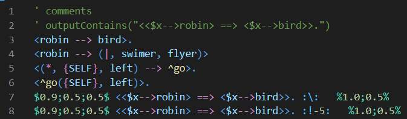

# `narsese` README

A *Narsese* syntax highlighting extension for Visual Studio Code.

*Narsese* is the representation language of Non-Axiomatic Reasoning System (NARS) ([more info](https://github.com/opennars/opennars/wiki/Narsese-Grammar-(Input-Output-Format))).

## Features

For any file with the suffix `*.nal`，the extension highlights the different parts of a Narsese sentence.

## Release Notes

### 0.0.1

Initial release of `narsese`.
